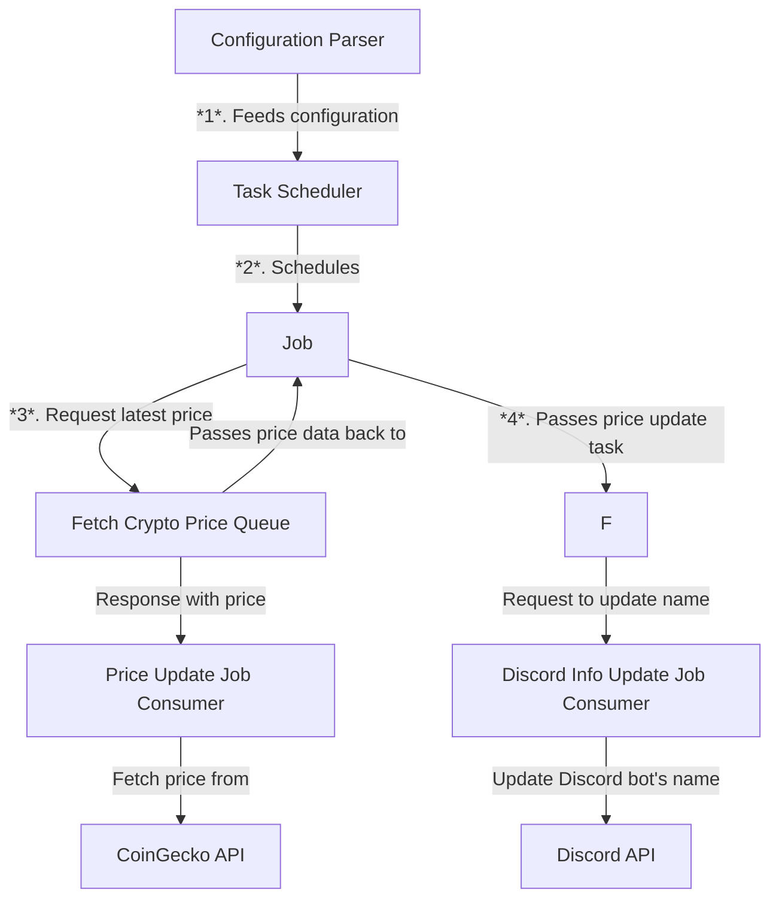

# Design Document for Discord Cryptocurrency/Stock Price Update Service

## Project Overview

This service is designed to provide real-time cryptocurrency and stock price updates on Discord servers. Its functionality is limited to updating Discord server data, specifically the bot's display name, to reflect the latest price information. This service does not interact with users or respond to commands.

## System Architecture

The system is composed of several key modules, each with a dedicated purpose:

* Configuration Parser: Initializes by reading the configuration file in JSON format, which specifies the tracked cryptocurrencies or stocks, update frequencies, and Discord authentication details.

* Task Scheduler: This core module runs indefinitely, timing each tick according to the configured update frequency. At each tick, it doesn't directly run tasks; instead, it creates a Job Definition that encapsulates the instructions for the required updates.

* Job Definition: This term has been refined to describe the set of instructions generated by the Task Scheduler. Each Job Definition is placed into the appropriate queue to be processed.

* Queues: There are two distinct in-memory queues handling different aspects of the job processing flow:

* Price Fetch Queue: Receives Job Definitions related to price fetching and delegates them to the Price Update Job Consumer.
    * Discord Update Queue: Receives Job Definitions with updated price data for the Discord bot name update, processed by the Discord Info Update Job Consumer.
    * Price Update Job Consumer: This worker takes a Job Definition from the Price Fetch Queue, retrieves the latest price data from an external API, and passes the data on.

* Discord Info Update Job Consumer: This worker takes the updated price data and applies it to update the Discord bot's display name via the Discord API.

## Configuration Details
The configuration file consists of multiple entries, each representing a different cryptocurrency or stock to track. An example entry is as follows:

```json
{
  "ticker": "ADAUSD",
  "name": "cardano",
  "crypto": true,
  "frequency": 15,
  "decimals": 2,
  "discord_bot_token": "${{ secrets.DISCORD_BOT_ADAUSD_TOKEN }}"
}
```

Each entry specifies the ticker for price fetching, a display name, a boolean indicating if it's a cryptocurrency, the update frequency in seconds, the number of decimal places for the price, and the Discord bot token for authentication.

## Dependencies
The service relies on several external APIs and libraries:

Rust crates for HTTP client functionality, JSON parsing, and Discord integration.
CoinGecko API to fetch cryptocurrency and stock prices.
Discord API to update the bot's display name.

## Data Flow

Upon initialization, the Configuration Parser loads the necessary details to configure the Task Scheduler. The Task Scheduler operates continuously, generating Job Definitions at intervals set in the configuration.

Each Job Definition specifies a two-part task flow:

1. Price Retrieval: The first task sends a request to the external API (e.g., CoinGecko) to fetch the latest price data.
Discord Update: The second task takes the fetched price and sends a request to update the Discord bot's display name.
2. Job Definitions are sequentially placed into the Price Fetch Queue and, upon successful price retrieval, moved to the Discord Update Queue. Each queue processes its Job Definitions one at a time, ensuring an orderly and manageable flow of tasks.



## Deployment and Containerization
The entire service is containerized, enabling it to be deployed consistently across any environment supporting containers. This approach simplifies the management of the service and encapsulates the background jobs along with the front-facing service in a single, scalable package.

The service's design is straightforward, focusing on functionality over complexity to serve as a proof of concept. Should the project transition to a more robust, commercial product, enhancements such as resource management, monitoring, dynamic configuration reloading, and redundancy planning would be recommended to ensure service reliability and efficiency.

## Limitations and Future Work

The initial version of the service is designed to meet the core requirement of updating cryptocurrency and stock prices on Discord servers. However, there are several features and enhancements that could be considered for future iterations:

1. Dynamic Configuration: The ability to update the configuration without restarting the service, which could include watching the configuration file for changes or implementing an admin interface for on-the-fly adjustments.

2. Persistent Queuing: Transition from in-memory queues to a persistent queuing system like RabbitMQ to ensure that jobs are not lost in case of service interruption or restart.

3. Enhanced Error Handling: More sophisticated error handling strategies, including exponential backoff for retries and alerting mechanisms for different types of failures.

4. Resource Management: Implementing detailed resource management to prevent memory leaks and CPU bottlenecks, which becomes essential as the service scales.

5. Monitoring and Logging: A comprehensive logging and monitoring system to track the service's health and performance metrics, aiding in troubleshooting and ensuring high availability.

6. Graceful Shutdown: A mechanism for gracefully shutting down the service to complete in-progress tasks and cleanly release resources.

7. Redundancy and Failover: Strategies for redundancy to avoid downtime, such as replica services, and failover mechanisms to handle unexpected failures gracefully.

8. Throttling and Rate Limiting: Although not required currently, future-proofing the system by implementing throttling and rate limiting to handle increased load or changes in third-party API policies.
